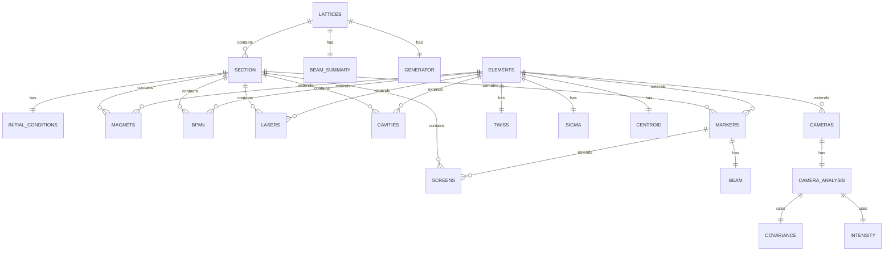

JANUS - Lattice API
===================

The [Lattice API](../../apps/api/lattice/) is a REST API implemented using [FastAPI](https://fastapi.tiangolo.com/) and [GraphQL](https://graphql.org/).


The [Lattice API](../../apps/api/lattice/) provides endpoints for creating, updating, retrieving, and managing lattice configurations within JANUS. It acts as the central interface between the database, simulation workflows, and downstream services.

You can access the FastAPI docs page when JANUS is running [here](http://localhost:1337/v1/docs)

---

### Core Responsibilities

- Persist lattice configurations in the database  
- Maintain the current active lattice in memory  
- Convert between API schemas and database models  
- Publish lattice lifecycle events to Kafka  
- Provide access to component metadata (e.g. magnets, screens, cavities)  

---

### Event Integration (Kafka)

The API publishes messages to Kafka topics to notify other services of lattice changes:

- `lattice_ready` – a new lattice is ready for processing  
- `lattice_added` – a lattice has been created and stored  
- `lattice_updated` – an existing lattice has been updated  

These events enable loosely coupled interaction with downstream services such as tracking, storage, and control systems.

---

### Key Endpoints

| Method | Endpoint | Description |
|--------|----------|-------------|
| `POST` | `/lattice/` | Create a new lattice |
| `PATCH` | `/lattice/` | Update active lattice and publish `lattice_ready` |
| `PATCH` | `/lattice/settings` | Update lattice settings only |
| `POST` | `/lattice/refresh` | Reload latest lattice from database |
| `GET` | `/lattice/` | Retrieve current or specified lattice |
| `GET` | `/lattice/uuid/latest` | Get UUID of active lattice |
| `GET` | `/lattice/runs` | List stored lattice UUIDs |

---

### Component Queries

The API exposes endpoints to query lattice components:

- `/lattice/cameras/names/`  
- `/lattice/screens/names/`  
- `/lattice/magnets/names/`  
- `/lattice/bpms/names/`  
- `/lattice/cavities/names/`  
- `/lattice/sections/names/`  

---

### Beam Data Access

Beam data associated with screens can be retrieved via:

```http
GET /lattice/screen/beam/?uuid=<lattice_uuid>&name=<screen_name>
```

#### Notes

- The API uses an in-memory lattice_manager to cache the active lattice
- All database interactions are handled via SQLAlchemy
- Lattices are uniquely identified using UUIDs
- Facility filtering is supported via the FACILITY environment variable

-----------


## GraphQL API

The GraphQL API provides a flexible and expressive interface for querying lattice data within JANUS.  
Unlike the REST API, it enables **complex, multi-criteria searches** across lattices, elements, beam properties, and generator configurations in a single request.

---

### Endpoint

The GraphQL API is exposed at: `/graphql`

This endpoint supports standard GraphQL queries via POST requests.

---

### Overview

The API is built using **Strawberry GraphQL** and SQLAlchemy, allowing:

- Flexible filtering across multiple domains (lattice, sections, elements, generator)
- Range-based queries for physics parameters (Twiss, beam sizes, magnet settings)
- Efficient database queries using SQL-level filtering where possible
- Fine-grained control over returned data structures

---

### Available Queries

The full list of queries can be found in the [schemas](../../apps/api/lattice/gql/schemas.py) file. The functions make use of the [resolvers](../../apps/api/lattice/gql/resolvers.py) where the logic for filtering the database against inputs is defined.

#### Lattice Queries

```graphql
findLattices(
  facility: String!
  setInitialConditions: String
  magnetFilter: [MagnetInput]
  cavityFilter: [CavityInput]
  sectionFilter: [SectionInput]
  generatorFilter: GeneratorInput
): [LatticeResult]
```

Find lattices using combinations of:

- Magnet filters
- Cavity filters
- Section filters
- Generator settings

#### Notes
- Queries operate directly on the database (no caching layer)
- Designed for search, filtering, and discovery
- Complements the REST API, which handles:
  - lattice creation and updates
  - Kafka event publication

------------


## Lattice Database

The Lattice database stores simulation results (referenced by `uuid`) in the `Lattice` table. Each `Lattice` has a list of `Section`s, `Generator`, and `BeamSummary`.

The `Section` table contains `InitialConditions` (starting Twiss for the section), the `name` of the section, the tracking `model` used for that section (ASTRA, elegant, Cheetah etc.).

Each `Section` also contains lists of beamline `Element`s such as:
- `Magnet`
- `Cavity`
- `BPM`
- `...`

All `Element`s has beam statistics like: `Twiss`, `Sigma`, and `Centroid`. The `Element` class is then inherited from to define more specific attributes. For instance, The `Element` sublclass `Screen` has a `Beam` attribute.

Below is an Entity-Relationship diagram for the tables in the Lattice database.

