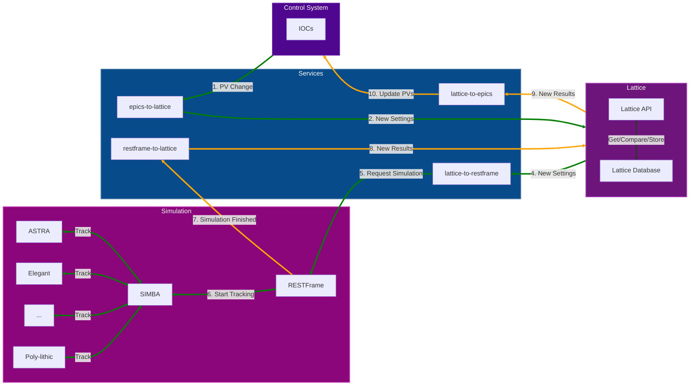
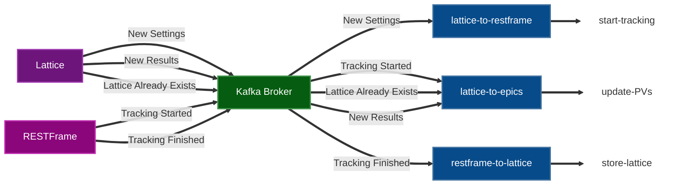

# JANUS - Joint Accelerator Network for Unified Simulation
JANUS is a series of Docker containers that allow users to interact with simulations of accelerator components, interact with virtual IOCs for EPICS components or trigger simulations using EPICS PVs.


## `JANUS` - System Overview

The JANUS components can be grouped into the following domains:

- **Control System**
  - [Shared (EPICS, PVA)](../apps/controls/shared/) - facility-agnostic control system for simulation control. Facility-specific control system logic can be added to this directory.
- **Lattice**
  - [API](../apps/api/lattice/)
  - [Database](../apps/api/lattice/)
- **Simulation**
  - [API](../apps/api/restframe/)
  - [Engine (SIMBA)](https://github.com/astec-stfc/simba)
- **Services**
  - `epics-to-lattice` - facility specific logic to convert control system values into `Lattice` format
    - [JFEL](../services/jfel/)
  - `lattice-to-restframe` - request simulation with settings in `Lattice` format
  - `restframe-to-lattice` - submit new results in `Lattice` format to database
  - `lattice-to-epics` - update shared control system with simulation results (using `Lattice` format)

#### Figure: `JANUS` - Control System ↔ Simulation

-----

## `JANUS` - Kafka Messaging

`JANUS` utilises the [Kafka - Python](https://kafka-python.readthedocs.io/en/master/) library to publish and consume messages via the kafka broker service. This method of orchestration allows asynchronous messaging between all containers.

The `Lattice` and `RESTFrame` APIs publish messages on the following topics:

- `Lattice`
  - `lattice_ready` - new settings have been made
  - `lattice_updated` - a previous lattice has been loaded from the database
  - `lattice_added` - a new lattice has been stored in the database
- `RESTFrame`
  - `tracking_started` - `SIMBA` tracking has started
  - `tracking finished` - `SIMBA` tracking has completed

The `Services` are responsbile for consuming those messages and acting accordingly.

`Services` subscriptions:
- `lattice-to-restframe`: `lattice_ready`
- `restframe-to-lattice`: `tracking_finished`
- `lattice-to-epics`: `lattice_updated`, `lattice_added`, `tracking_finished`



--------

## Development Environment - Sandbox

### Overview
The `sandbox` service provides an interactive environment for working with **EPICS PVs** and JANUS-related Python tooling. It is primarily used for development, testing, and debugging.

---

### Features
- EPICS CA/PVA CLI tools (`ca/pvaget`, `ca/pvput`, `ca/pvmonitor`, etc.)
- Python environment with project dependencies ([pyepics](https://pyepics.github.io/pyepics/overview.html), [p4p](https://epics-base.github.io/p4p/index.html))
- [Jupyter Lab](https://jupyter.org/) for interactive workflows
- Non-root user (`janus-developer`)

---

### Usage
Start the sandbox:

```bash
docker compose -f docker-compose.jfel.yml up sandbox
```

Access Jupyter Lab: `http://localhost:8889`
:
- EPICS
  - `EPICS_CA_ADDR_LIST=ioc` – connects to IOC container
  - `EPICS_CA_SERVER_PORT=6090`
  - `EPICS_PVA_AUTO_ADDR_LIST=YES` - connects to physics IOC container
- Jupyter
  - Runs on port 8889
  - No authentication (dev use only)
- Volumes
  -  `sandbox/workspace → /home/janus-developer/workspace`
  - Persistent workspace for notebooks and scripts.