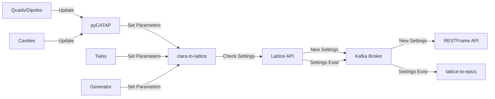

JANUS - CLARA to Lattice
========================

The `clara` service is responsible for sending changes in the EPICS control system to the [Lattice API](../../apps/api/lattice/) using the [schema](../../janus_common/schemas/) classes.

The [clara](../../services/clara/) service utilises the `pyCATAP` middle-layer to easily retrieve the values of PVs for the systems listed below and compare with the [Lattice API](../../apps/api/lattice/) entries.

The EPICS settings are checked against entries in the [Lattice API](../../apps/api/lattice/) database. If there are no matching lattices, the settings are sent for tracking.

However, if a matching lattice is found, the uuid is sent via the kafka topic `lattice_updated` which is received by the `lattice-to-epics` message (see [shared services](../services/shared.md) for more details).

#### CLARA to Lattice Diagram

### Control Parameters

The parameters that are checked for changes are:

----
#### RF Cavities
- Off Crest Phase (degrees)
- Power (MW)

----

#### Quadrupoles

- Integrated Strength -K1L (m⁻¹)

----

#### Dipoles

- Bending Angle - K0L (degrees)

----

#### Initial Twiss

- βx βy
- αx αy
- εx εy
- εx εy (Normalised)
- ηx ηy 
- ηxρ ηyρ

----

#### Generator - Beam and Particle Parameters

- Number of particles
- Species
- Charge
- Probe particle
- Cathode
- Noise reduction
- Combine distributions

#### Generator - Initial Conditions
- Initial momentum
- Kinetic‑energy correlation

#### Generator - Distribution Types
- Distribution type (x)
- Distribution type (ρx)
- Distribution type (y)
- Distribution type (ρy)
- Distribution type (z)
- Distribution type (ρz)

#### Generator - RMS Beam Sizes and Moments
- σx
- σp x
- σy
- σp y
- σz
- σp z

#### Generator - Gaussin Cut-offs
- Gaussian cut‑off (x)
- Gaussian cut‑off (ρx)
- Gaussian cut‑off (y)
- Gaussian cut‑off (ρy)
- Gaussian cut‑off (z)
- Gaussian cut‑off (ρz)

#### Generator - Offsets and Correlations
- Offset (x)
- Offset (y)
- Correlation (ρx)
- Correlation (ρy)

#### Generator - Emittance Parameters
- Normalised emittance εn,x
- Normalised emittance εn,y
- Thermal emittance