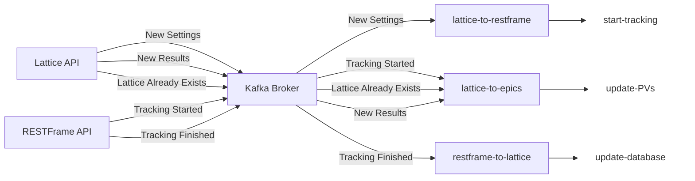

JANUS - Shared Services
========================

The following services pass [schema](../../common/schemas/) information between JANUS [APIs](../../apps/api) and [Control Systems](../../apps/controls/).
They are designed to be facility agnostic and do not require any conversion between simulation and controls information.

These services are:

- [lattice-to-restframe](../../services/shared/lattice-to-restframe/) submits lattice data for tracking
- [restframe-to-lattice](../../services/shared/restframe-to-lattice/) submits lattice data for storage
- [lattice-to-epics](../../services/shared/lattice-to-epics/) forwards lattice data to control system PVs

Kafka Topic Subscriptions
==========================

The shared services subscribe to message topics that are produced by the [APIs](../../apps/api). Once a message with a given topic is consumed, each service performs the corresponding actions.

#### `lattice-to-restframe`

- Group ID: `lattice-to-restframe`
- Subscribed to:
  - `lattice_ready`
- Actions:
  - `lattice_ready`: Get most recent lattice from [Lattice API](../../apps/api/lattice/), send it to [RESTFrame](../../apps/api/restframe/). Start tracking!

#### `restframe-to-lattice`

- Group ID: `restframe-to-lattice`
- Subscribed to:
  - `tracking_finished`
- Actions:
  - `tracking_finished`: Get lattice from [RESTFrame](../../apps/api/restframe/) and compare with uuids from [Lattice API](../../apps/api/lattice/), if we have a new uuid, then submit the lattice to the database.

#### `lattice-to-epics`

- Group ID: `lattice-to-epics`
- Subscribed to:
  - `tracking_started`, `lattice_added`, `lattice_updated`
- Actions:
  - `tracking_started`: Set the `SIMULATION:STATUS` PV to `TRACKING (1)`
  - `lattice_added`: A new lattice arrives in the database, grab it using the uuid! Set all PVs using that lattice
  - `lattice_updated`: The user's lattice already existed in the database (did not need to use RESTFrame) so grab that lattice and set all PVs with the contents.

#### Messaging Diagram:

